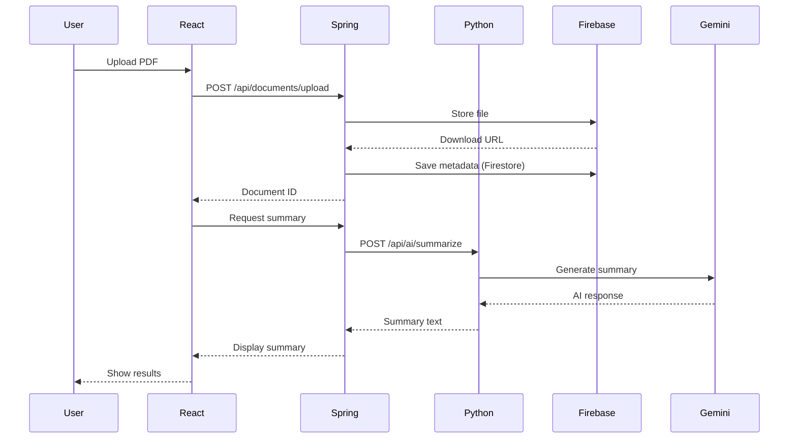

# 🎓 Smart Study Buddy

> An AI-powered study assistant that transforms your PDFs and YouTube videos into interactive learning experiences using Google's Gemini AI.

[](https://www.oracle.com/java/)
[](https://spring.io/projects/spring-boot)
[](https://www.python.org/)
[](https://fastapi.tiangolo.com/)
[](https://reactjs.org/)
[](LICENSE)

## 📋 Table of Contents

- [Overview](#-overview)
- [Features](#-features)
- [Architecture](#-architecture)
- [Tech Stack](#-tech-stack)
- [Prerequisites](#-prerequisites)
- [Installation](#-installation)
- [Configuration](#-configuration)
- [Running the Application](#-running-the-application)
- [API Documentation](#-api-documentation)
- [Project Structure](#-project-structure)
- [Screenshots](#-screenshots)
- [Contributing](#-contributing)
- [License](#-license)

## 🌟 Overview

**Smart Study Buddy** is a comprehensive full-stack application designed to revolutionize the way students learn. By leveraging cutting-edge AI technology, it transforms static study materials into dynamic, interactive learning tools.

### What Makes It Special?

- 🤖 **AI-Powered**: Uses Google's Gemini AI for intelligent content analysis
- 📄 **PDF Support**: Upload and analyze PDF documents
- 🎥 **YouTube Integration**: Extract and study from YouTube video transcripts
- 💬 **Interactive Q&A**: Ask questions and get context-aware answers
- 🎴 **Smart Flashcards**: Auto-generated flashcards for efficient memorization
- 📝 **Adaptive Quizzes**: AI-generated quizzes to test your knowledge
- 🔒 **Secure**: Firebase authentication and user data protection
- 💾 **Cloud Storage**: All your materials safely stored in the cloud

## ✨ Features

### 📚 Document Management
- **Upload PDFs**: Drag-and-drop or click to upload study materials
- **YouTube Videos**: Paste any YouTube URL to extract transcripts
- **Cloud Storage**: All documents securely stored in Firebase Storage
- **Quick Access**: View all your materials from a centralized dashboard

### 🧠 AI-Powered Learning Tools

#### 1. Smart Summarization
- Generates concise, student-friendly summaries
- Uses conversational tone for better understanding
- Highlights key concepts and takeaways
- Markdown formatting for readability

#### 2. Interactive Q&A
- Ask questions about your study materials
- Context-aware responses based on document content
- Maintains conversation history for follow-up questions
- Augmented with broader AI knowledge when needed

#### 3. Flashcard Generator
- Automatically creates 10 flashcards per document
- Interactive flip animations
- Track your progress with "Know it" / "Still learning"
- Shuffle mode for varied practice

#### 4. Quiz Generator
- Generates 10 multiple-choice questions
- Mixed difficulty levels (easy, medium, hard)
- Immediate feedback on answers
- Detailed explanations for correct answers
- Score tracking and retake options

### 🔐 User Authentication
- Secure email/password registration
- Firebase-powered authentication
- Protected routes and user-specific data
- Session management with custom tokens

## 🏗️ Architecture

Smart Study Buddy follows a modern **three-tier microservices architecture**:

```
┌─────────────────────────────────────────────────────────────┐
│                     Frontend Layer                          │
│                  React + Vite + Tailwind                    │
│                    (Port 5173)                              │
└────────────────────┬────────────────────────────────────────┘
                     │ HTTP/REST
                     ▼
┌─────────────────────────────────────────────────────────────┐
│                    Backend Layer                            │
│              Spring Boot + Firebase                         │
│                    (Port 8080)                              │
└────────────┬───────────────────────┬────────────────────────┘
             │                       │
             │ HTTP/REST             │ Firebase SDK
             ▼                       ▼
┌────────────────────────┐  ┌──────────────────────┐
│   AI Service Layer     │  │  External Services   │
│  Python + FastAPI      │  │  - Firestore DB      │
│     (Port 8000)        │  │  - Firebase Storage  │
└──────────┬─────────────┘  │  - Firebase Auth     │
           │                └──────────────────────┘
           │ Google Cloud SDK
           ▼
┌────────────────────────┐
│   Google Vertex AI     │
│   (Gemini Models)      │
└────────────────────────┘
```

### Data Flow Example: Document Upload & Summary



## 🛠️ Tech Stack

### Frontend
| Technology | Version | Purpose |
|------------|---------|---------|
| React | 19.2.0 | UI framework |
| Vite | 7.2.4 | Build tool & dev server |
| React Router | 7.10.1 | Client-side routing |
| Axios | 1.13.2 | HTTP client |
| Tailwind CSS | 3.4.19 | Styling framework |
| React-PDF | 10.2.0 | PDF rendering |

### Backend (Spring Boot)
| Technology | Version | Purpose |
|------------|---------|---------|
| Spring Boot | 3.2.0 | Backend framework |
| Java | 21 | Programming language |
| Spring Security | - | Authentication & authorization |
| Firebase Admin SDK | 9.2.0 | Firebase integration |
| Apache PDFBox | 3.0.0 | PDF processing |
| OkHttp | 4.12.0 | HTTP client |

### AI Service (Python)
| Technology | Version | Purpose |
|------------|---------|---------|
| FastAPI | 0.115.6 | API framework |
| Uvicorn | 0.32.1 | ASGI server |
| Google Cloud AI Platform | 1.38.0 | Vertex AI integration |
| PyPDF2 | 3.0.1 | PDF text extraction |
| yt-dlp | 2025.12.8 | YouTube transcript extraction |
| Pydantic | 2.10.3 | Data validation |

### Infrastructure
- **Database**: Google Firestore (NoSQL)
- **Storage**: Firebase Storage
- **Authentication**: Firebase Authentication
- **AI**: Google Vertex AI (Gemini 1.5 Flash)

## 📦 Prerequisites

Before you begin, ensure you have the following installed:

- **Java Development Kit (JDK) 21** or higher
  - [Download JDK](https://www.oracle.com/java/technologies/downloads/)
  - Verify: `java -version`

- **Maven 3.6+** (usually comes with JDK)
  - Verify: `mvn -version`

- **Python 3.8+**
  - [Download Python](https://www.python.org/downloads/)
  - Verify: `python --version`

- **Node.js 16+** and npm
  - [Download Node.js](https://nodejs.org/)
  - Verify: `node -v` and `npm -v`

- **Firebase Project**
  - Create a project at [Firebase Console](https://console.firebase.google.com/)
  - Enable Firestore Database
  - Enable Firebase Storage
  - Enable Firebase Authentication (Email/Password)

- **Google Cloud Project**
  - Create a project at [Google Cloud Console](https://console.cloud.google.com/)
  - Enable Vertex AI API
  - Create a service account with Vertex AI permissions

## 🚀 Installation

### 1. Clone the Repository

```bash
git clone https://github.com/yourusername/Smart-Study-Buddy.git
cd Smart-Study-Buddy
```

### 2. Set Up Firebase

1. Go to [Firebase Console](https://console.firebase.google.com/)
2. Create a new project or select existing one
3. Navigate to **Project Settings** → **Service Accounts**
4. Click **Generate New Private Key**
5. Save the JSON file as `service-account-key.json`
6. Place it in a secure location (DO NOT commit to Git)

### 3. Set Up Google Cloud (Vertex AI)

1. Go to [Google Cloud Console](https://console.cloud.google.com/)
2. Enable **Vertex AI API**
3. Create a service account with **Vertex AI User** role
4. Generate and download the JSON key
5. You can use the same service account key as Firebase if both are in the same project

## ⚙️ Configuration

### Spring Backend Configuration

1. Navigate to the Spring backend directory:
```bash
cd Spring-backend
```

2. Create `src/main/resources/application.properties`:
```properties
server.port=8080
spring.servlet.multipart.max-file-size=50MB
spring.servlet.multipart.max-request-size=50MB
```

3. Set environment variable for Firebase credentials:

**Windows (PowerShell):**
```powershell
$env:GOOGLE_APPLICATION_CREDENTIALS="C:\path\to\service-account-key.json"
```

**macOS/Linux:**
```bash
export GOOGLE_APPLICATION_CREDENTIALS="/path/to/service-account-key.json"
```

### Python AI Service Configuration

1. Navigate to the Python service directory:
```bash
cd python-ai-service
```

2. Create a `.env` file:
```env
VERTEX_AI_PROJECT_ID=your-google-cloud-project-id
VERTEX_AI_LOCATION=us-central1
VERTEX_AI_MODEL=gemini-1.5-flash-002
GOOGLE_APPLICATION_CREDENTIALS=/path/to/service-account-key.json
```

3. Install Python dependencies:
```bash
pip install -r requirements.txt
```

### React Frontend Configuration

1. Navigate to the React frontend directory:
```bash
cd react-frontend
```

2. Install dependencies:
```bash
npm install
```

3. (Optional) Update API URLs in `src/services/api.js` if needed:
```javascript
const API_URL = "http://localhost:8080/api";
```

## 🏃 Running the Application

You need to start all three services. Open **three separate terminal windows**:

### Terminal 1: Start Spring Backend

```bash
cd Spring-backend
./mvnw spring-boot:run
```

**Windows:**
```powershell
cd Spring-backend
.\mvnw.cmd spring-boot:run
```

✅ Backend running at: `http://localhost:8080`

### Terminal 2: Start Python AI Service

```bash
cd python-ai-service
uvicorn main:app --reload --port 8000
```

✅ AI Service running at: `http://localhost:8000`
📚 API Docs available at: `http://localhost:8000/docs`

### Terminal 3: Start React Frontend

```bash
cd react-frontend
npm run dev
```

✅ Frontend running at: `http://localhost:5173`

### 🎉 Access the Application

Open your browser and navigate to:
```
http://localhost:5173
```

## 📖 API Documentation

### Authentication Endpoints

#### Register User
```http
POST /api/auth/register
Content-Type: application/json

{
  "username": "johndoe",
  "email": "john@example.com",
  "password": "securePassword123"
}
```

**Response:**
```json
{
  "userId": "firebase-uid",
  "email": "john@example.com",
  "username": "johndoe",
  "customToken": "eyJhbGc..."
}
```

#### Login
```http
POST /api/auth/login
Content-Type: application/json

{
  "email": "john@example.com",
  "password": "securePassword123"
}
```

### Document Endpoints

#### Upload PDF
```http
POST /api/documents/upload
Authorization: Bearer {token}
Content-Type: multipart/form-data

file: [PDF file]
userId: "user-id"
```

#### Get User Documents
```http
GET /api/documents?userId={userId}
Authorization: Bearer {token}
```

#### Get Document Content
```http
GET /api/documents/{documentId}/content?userId={userId}
Authorization: Bearer {token}
```

#### Delete Document
```http
DELETE /api/documents/{documentId}?userId={userId}
Authorization: Bearer {token}
```

### AI Endpoints

#### Generate Summary
```http
POST /api/ai/summarize
Authorization: Bearer {token}
Content-Type: application/json

{
  "text": "Document text to summarize...",
  "document_id": "doc-id"
}
```

#### Ask Question
```http
POST /api/ai/ask
Authorization: Bearer {token}
Content-Type: application/json

{
  "text": "Document context...",
  "question": "What is the main topic?",
  "document_id": "doc-id",
  "chat_history": [
    {
      "question": "Previous question",
      "answer": "Previous answer"
    }
  ]
}
```

#### Generate Flashcards
```http
POST /api/ai/flashcards
Authorization: Bearer {token}
Content-Type: application/json

{
  "text": "Document text...",
  "document_id": "doc-id"
}
```

**Response:**
```json
{
  "flashcards": [
    {
      "question": "What is photosynthesis?",
      "answer": "The process by which plants convert light energy into chemical energy."
    }
  ],
  "count": 10
}
```

#### Generate Quiz
```http
POST /api/ai/generate-quiz
Authorization: Bearer {token}
Content-Type: application/json

{
  "text": "Document text...",
  "document_id": "doc-id"
}
```

**Response:**
```json
{
  "quiz": [
    {
      "question": "What is the primary function of mitochondria?",
      "options": [
        "Energy production",
        "Protein synthesis",
        "DNA replication",
        "Waste removal"
      ],
      "correctAnswer": 0,
      "explanation": "Mitochondria are known as the powerhouse of the cell..."
    }
  ],
  "count": 10
}
```

### YouTube Endpoints

#### Upload YouTube Video
```http
POST /api/youtube/upload
Authorization: Bearer {token}
Content-Type: application/json

{
  "url": "https://www.youtube.com/watch?v=VIDEO_ID",
  "userId": "user-id"
}
```

## 📂 Project Structure

```
Smart-Study-Buddy/
│
├── Spring-backend/                 # Java Spring Boot Backend
│   ├── src/
│   │   ├── main/
│   │   │   ├── java/com/Smart_Study_Buddy/Spring_backend/
│   │   │   │   ├── config/        # Configuration classes
│   │   │   │   ├── controller/    # REST controllers
│   │   │   │   ├── dto/           # Data Transfer Objects
│   │   │   │   ├── security/      # Security filters
│   │   │   │   └── service/       # Business logic services
│   │   │   └── resources/
│   │   │       └── application.properties
│   │   └── test/
│   └── pom.xml                    # Maven dependencies
│
├── python-ai-service/             # Python FastAPI AI Service
│   ├── main.py                    # FastAPI application
│   ├── requirements.txt           # Python dependencies
│   ├── .env                       # Environment variables
│   ├── models/
│   │   └── schemas.py            # Pydantic models
│   └── services/
│       ├── gemini_service.py     # Gemini AI integration
│       ├── pdf_service.py        # PDF processing
│       ├── smart_summarizer.py   # Advanced summarization
│       └── youtube_service.py    # YouTube integration
│
├── react-frontend/                # React Frontend
│   ├── src/
│   │   ├── components/           # React components
│   │   │   ├── Dashboard.jsx
│   │   │   ├── DocumentViewer.jsx
│   │   │   ├── Flashcards.jsx
│   │   │   ├── Quiz.jsx
│   │   │   ├── Login.jsx
│   │   │   ├── Register.jsx
│   │   │   └── ...
│   │   ├── services/
│   │   │   └── api.js           # API client
│   │   ├── App.jsx              # Main app component
│   │   └── main.jsx             # Entry point
│   ├── package.json             # NPM dependencies
│   ├── vite.config.js          # Vite configuration
│   └── tailwind.config.js      # Tailwind CSS config
│
├── .gitignore
└── README.md
```

## 📸 Screenshots

### Dashboard

*Main dashboard showing uploaded documents and YouTube videos*

### Document Viewer with AI Summary

*PDF viewer with AI-generated summary and Q&A interface*

### Interactive Flashcards

*Flip-style flashcards with progress tracking*

### AI-Generated Quiz

*Multiple-choice quiz with immediate feedback*

## 🔧 Development

### Running Tests

**Spring Backend:**
```bash
cd Spring-backend
./mvnw test
```

**Python AI Service:**
```bash
cd python-ai-service
pytest
```

**React Frontend:**
```bash
cd react-frontend
npm test
```

### Code Formatting

**Java (Spring Boot):**
```bash
./mvnw spring-javaformat:apply
```

**Python:**
```bash
black .
flake8 .
```

**JavaScript/React:**
```bash
npm run lint
```

## 🐛 Troubleshooting

### Common Issues

#### 1. Firebase Authentication Error
**Error:** `401 Unauthorized` or `Firebase app not initialized`

**Solution:**
- Verify `GOOGLE_APPLICATION_CREDENTIALS` environment variable is set correctly
- Ensure service account key JSON file exists and has correct permissions
- Check Firebase project settings

#### 2. Vertex AI Model Not Found
**Error:** `Model not found` or `Permission denied`

**Solution:**
- Verify Vertex AI API is enabled in Google Cloud Console
- Check service account has `Vertex AI User` role
- Ensure `VERTEX_AI_PROJECT_ID` matches your Google Cloud project
- Verify model name is correct: `gemini-1.5-flash-002`

#### 3. CORS Errors
**Error:** `CORS policy: No 'Access-Control-Allow-Origin' header`

**Solution:**
- Check `CorsConfig.java` in Spring backend
- Verify frontend URL is in allowed origins
- Ensure both services are running on correct ports

#### 4. PDF Upload Fails
**Error:** `File too large` or `Upload failed`

**Solution:**
- Check file size limit in `application.properties`
- Verify Firebase Storage rules allow uploads
- Ensure user is authenticated

#### 5. YouTube Transcript Extraction Fails
**Error:** `Transcript not available`

**Solution:**
- Verify video has captions/subtitles enabled
- Check if video is publicly accessible
- Try a different video URL format

### Logs

**View Spring Boot logs:**
```bash
cd Spring-backend
tail -f logs/spring-boot-application.log
```

**View Python service logs:**
```bash
cd python-ai-service
# Logs appear in terminal where uvicorn is running
```

**View React dev server logs:**
```bash
cd react-frontend
# Logs appear in terminal where Vite is running
```

## 🚀 Deployment

### Docker Deployment (Recommended)

Create `docker-compose.yml`:

```yaml
version: '3.8'

services:
  backend:
    build: ./Spring-backend
    ports:
      - "8080:8080"
    environment:
      - GOOGLE_APPLICATION_CREDENTIALS=/app/service-account-key.json
    volumes:
      - ./service-account-key.json:/app/service-account-key.json

  ai-service:
    build: ./python-ai-service
    ports:
      - "8000:8000"
    environment:
      - VERTEX_AI_PROJECT_ID=${VERTEX_AI_PROJECT_ID}
      - VERTEX_AI_LOCATION=${VERTEX_AI_LOCATION}
      - VERTEX_AI_MODEL=${VERTEX_AI_MODEL}
    volumes:
      - ./service-account-key.json:/app/service-account-key.json

  frontend:
    build: ./react-frontend
    ports:
      - "80:80"
    depends_on:
      - backend
      - ai-service
```

Run:
```bash
docker-compose up -d
```

### Cloud Deployment Options

- **Google Cloud Run**: Deploy containerized services
- **AWS Elastic Beanstalk**: For Spring Boot backend
- **Vercel/Netlify**: For React frontend
- **Heroku**: For all services

## 🤝 Contributing

Contributions are welcome! Please follow these steps:

1. **Fork the repository**
2. **Create a feature branch**
   ```bash
   git checkout -b feature/amazing-feature
   ```
3. **Commit your changes**
   ```bash
   git commit -m 'Add some amazing feature'
   ```
4. **Push to the branch**
   ```bash
   git push origin feature/amazing-feature
   ```
5. **Open a Pull Request**

### Coding Standards

- Follow existing code style
- Write meaningful commit messages
- Add tests for new features
- Update documentation as needed

## 📄 License

This project is licensed under the MIT License - see the [LICENSE](LICENSE) file for details.

## 👥 Authors

- **Your Name** - *Initial work* - [YourGitHub](https://github.com/yourusername)

## 🙏 Acknowledgments

- Google Gemini AI for powerful language models
- Firebase for authentication and storage
- Spring Boot community
- FastAPI community
- React community

## 📞 Support

For support, email support@smartstudybuddy.com or open an issue in the GitHub repository.

## 🗺️ Roadmap

- [ ] Mobile app (React Native)
- [ ] Collaborative study sessions
- [ ] Voice-to-text note taking
- [ ] Integration with more video platforms
- [ ] Advanced analytics and progress tracking
- [ ] Spaced repetition algorithm for flashcards
- [ ] Export study materials to various formats
- [ ] Dark mode support

---

<div align="center">

**Made with ❤️ by students, for students**

⭐ Star this repo if you find it helpful!

[Report Bug](https://github.com/yourusername/Smart-Study-Buddy/issues) · [Request Feature](https://github.com/yourusername/Smart-Study-Buddy/issues)

</div>
